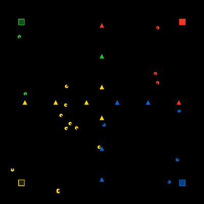

# `github.com/46bit/rts`



This is a simple Real-Time Strategy game played by AIs. Each player gets a factory which constantly produces units. Units capture generators. Generators provide resources to produce users quicker.

## How to play

To play the `maps/cross.yml` map:

```sh
git clone github.com/46bit/rts
cd rts
bundle install
bundle exec ./bin/rts maps/cross.yml
```

## Note on file descriptor limits

The game will increase its file descriptor limit to the maximum possible, but you will encounter problems if you have more units than file descriptors. This is due to a font handling limitation in the rendering libraries used.
